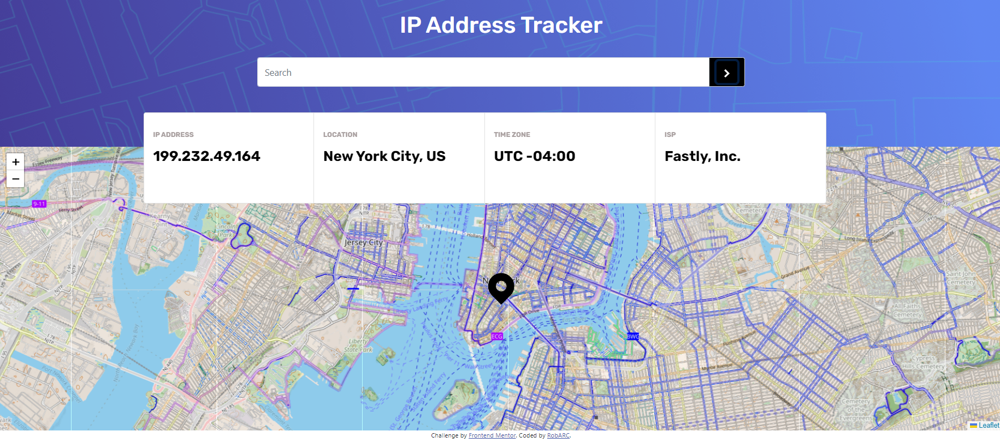

# Frontend Mentor - IP address tracker solution

This is a solution to the [IP address tracker challenge on Frontend Mentor](https://www.frontendmentor.io/challenges/ip-address-tracker-I8-0yYAH0). Frontend Mentor challenges help you improve your coding skills by building realistic projects. 

## Table of contents

- [Overview](#overview)
  - [The challenge](#the-challenge)
  - [Screenshot](#screenshot)
  - [Links](#links)
- [My process](#my-process)
  - [Built with](#built-with)
  - [What I learned](#what-i-learned)
  - [Continued development](#continued-development)
  - [Useful resources](#useful-resources)
- [Author](#author)
- [Acknowledgments](#acknowledgments)

**Note: Delete this note and update the table of contents based on what sections you keep.**

## Overview

### The challenge

Users should be able to:

- View the optimal layout for each page depending on their device's screen size
- See hover states for all interactive elements on the page
- See their own IP address on the map on the initial page load
- Search for any IP addresses or domains and see the key information and location

### Screenshot

#### My Solution




### Links

- Solution URL: [Add solution URL here](https://your-solution-url.com)
- Live Site URL: [Add live site URL here](https://your-live-site-url.com)

## My process

### Built with
- Angular 15
- Semantic HTML5 markup
- SCSS custom properties
- Mobile-first workflow
- [Angular](https://angular.io//) - Angular Framework

### What I learned

First, you should create a count in Geolocation API by IPify, to run this proyect.

What did I learn from this project? The first thing that comes to mind is to use environment variables to hide important data, such as keys. I have used them in other non-Angular projects. 

I also learned about the "ngAfterContentInit" method; which is a lifecycle method in Angular that is used in components to perform actions after the projected content in a component has been initialized. This method is triggered once Angular has initialized the properties with projected content on a component. 
You can use ngAfterContentInit to perform initial configurations, subscribe to projected component events, or execute logic that depends on the projected content.
ngAfterContentInit is not called on the root component (AppComponent), since it has no projected content.
ngAfterContentInit is called after Angular has processed the projected content in a component, which means that you can access the projected directives and components at this point.

I learned the basics about the leaflet library, which is an open-source JavaScript library, friendly for mobile and interactive maps. Simple but powerful and very versatile.

The last learning was with Geolocation API by IPify, this API is the one that we consult to obtain the data of a given ip address, offering us a lot of interesting data, for the geolocation address. Also very simple but functional for our work.


To see how you can add code snippets, see below:

```html
<h1>Some HTML code I'm proud of</h1>
```
```css
@media screen and  (max-width: 375px) {
    .container {
    width: 100%;
    margin-right: 0px;
    margin-left: 0px;
    }
```
```ts
getAll(ip: string): Observable<any>{
    return this.http.get<any>(environment.url+'&ipAddress='+ip)
  }
```

### Useful resources

- [Leaflet](https://leafletjs.com/) - an open-source JavaScript library
for mobile-friendly interactive maps
- [IP Geolocation API](https://geo.ipify.org/) - Our real-time IP Geolocation API lets you look up IP locations accurately.

- [Angular] (https://angular.io/) - My favorite framework.

-[Angular University] (https://angular-university.io/) - Courses for All Levels Videos and E-Books.

## Author

- Website - [Roberth Rondón](https://robarc.github.io/)
- Frontend Mentor - [@RobARC](https://www.frontendmentor.io/profile/RobARC)
- Twitter - [@rrondonc](https://twitter.com/rrondonc)

## Acknowledgments

To Almighty God! for Computers and Software and the channel https://www.youtube.com/@mugan86 helpme to 
find my own solution.
